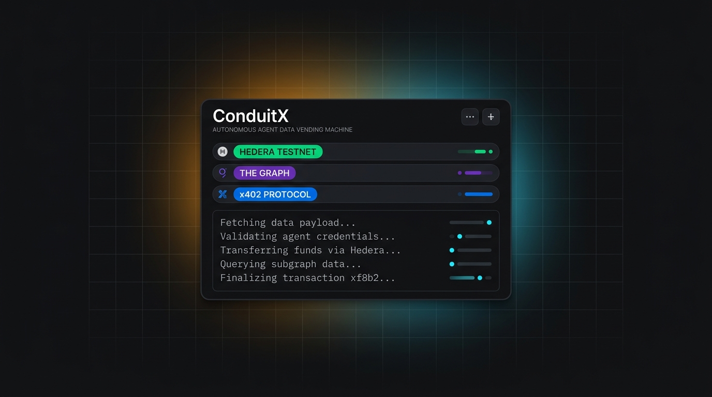
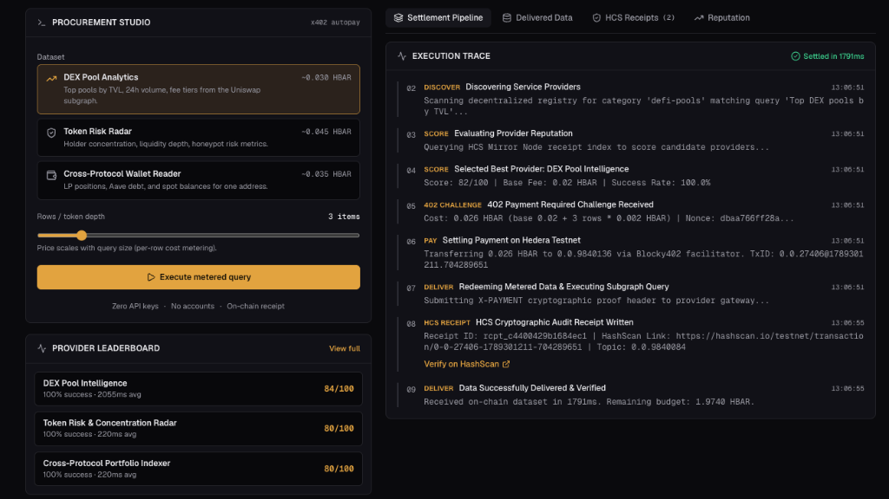
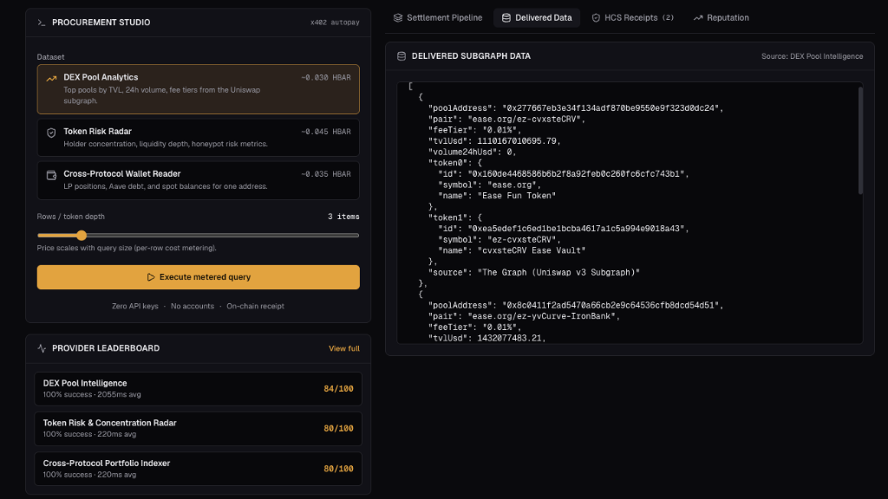
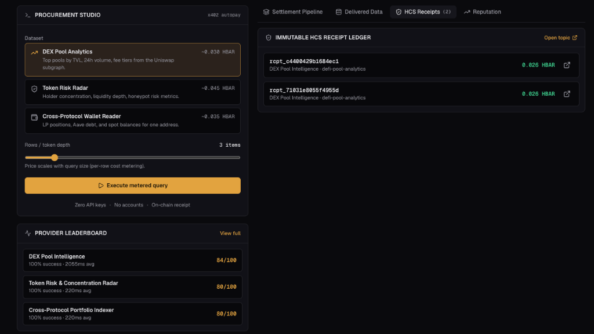
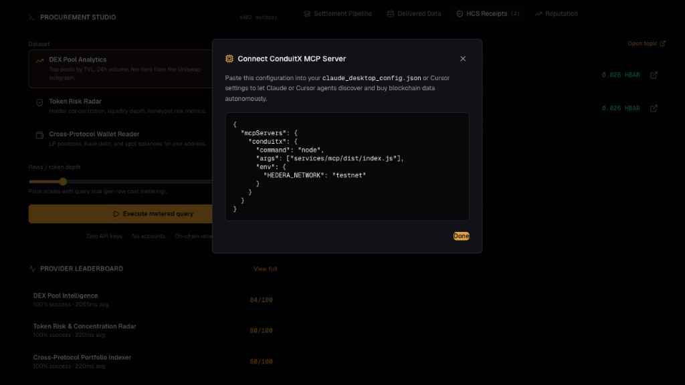

# ConduitX — The Decentralized Agent Data Vending Machine



[](https://hashscan.io/testnet)
[](https://thegraph.com/)
[](https://x402.org)
[](https://modelcontextprotocol.io/)
[](https://nextjs.org/)
[](https://www.typescriptlang.org/)
[](LICENSE)

> **"Agent payments have a rail. They don't have a market."**

ConduitX is the decentralized market and execution layer for autonomous AI agents to discover, procure, meter, and cryptographically audit on-chain data. Agents buy blockchain data one query at a time, settle micro-cents in real-time over **x402 on Hedera**, and generate immutable execution receipts published to **Hedera Consensus Service (HCS)**. Those receipts form a tamper-proof, objective reputation signal that buyer agents audit before executing transactions.

---

## 🖥️ Workstation Dashboard & Execution Traces

| Settlement Pipeline (Sub-2s Execution) | Delivered Subgraph Data (Uniswap v3) |
|:---:|:---:|
|  |  |
| **Immutable HCS Receipt Ledger** | **Claude Desktop & Cursor (MCP Tooling)** |
|  |  |

---

## 🏛️ System Architecture

```mermaid
flowchart TD
    subgraph Buyer ["AI Buyer Agent (Claude / Cursor / Script)"]
        Agent["Autonomous Agent"] --> Broker["ConduitX Broker Engine"]
        MCP["ConduitX MCP Server"] --> Broker
    end

    subgraph RegistryLayer ["Marketplace & Reputation"]
        Registry["Service Registry"]
        Reputation["Reputation Aggregator\n(Score = w₁·1/P + w₂·S + w₃·R)"]
    end

    subgraph HederaRail ["Hedera Settlement & Audit Trail"]
        Facilitator["x402 Facilitator / Transfer"]
        HCSTopic["HCS Topic: 0.0.5694210\n(Cryptographic Receipts)"]
        MirrorNode["Hedera Mirror Node REST"]
    end

    subgraph DataSellers ["The Graph Live Data Sellers"]
        S1["DEX Pool Analytics\n(Uniswap v3 Subgraph)"]
        S2["Token Risk Radar\n(ERC20 & Security Subgraph)"]
        S3["Wallet Portfolio Reader\n(Aave & Protocol Subgraphs)"]
    end

    Broker -->|1. Discover & Fetch Scores| Registry
    Registry <-->|Read Past Receipts| MirrorNode
    Broker -->|2. Send Query (No Auth)| S1
    S1 -->|3. HTTP 402 Challenge (Cost Metered)| Broker
    Broker -->|4. Settle Micro-Payment| Facilitator
    Broker -->|5. Retry with X-PAYMENT Proof| S1
    S1 -->|6. Query Subgraph Studio| TheGraph["The Graph Subgraph Studio"]
    S1 -->|7. Publish Cryptographic Receipt| HCSTopic
    S1 -->|8. Deliver Data + Receipt Link| Broker
    Broker -->|9. Update Live Feed| Console["Live Next.js Console Dashboard"]
```

---

## ⚡ Core Protocol Pillars & Infrastructure

### 1. 🟢 Hedera Settlement & HCS Consensus Audit Trail
- **Live x402-Gated Metering**: Implemented in [`packages/x402-hedera`](file:///packages/x402-hedera) and [`services/meter`](file:///services/meter). Dynamic query pricing scales based on complexity (base fee + per-row returned) rather than flat subscriptions.
- **Micro-Payment Settlement**: Autonomous settlement on Hedera via native Transfer transactions and the Blocky402 facilitator with sub-second finality.
- **Immutable HCS Audit Trail**: Every executed query publishes a cryptographic receipt message to HCS Topic [`0.0.5694210`](https://hashscan.io/testnet/topic/0.0.5694210) via [`packages/receipts`](file:///packages/receipts).
- **HCS Mirror Node Indexing**: Mirror Node REST integration queries consensus timestamps and execution proofs to compute live, tamper-proof provider SLA metrics.

### 2. 🟣 The Graph Decentralized Data Providers
- **Live Subgraph Studio Data Sellers**:
  - [`services/seller-pools`](file:///services/seller-pools): Real-time Uniswap v3 pool liquidity, 24h trading volume, and fee tier analytics.
  - [`services/seller-risk`](file:///services/seller-risk): Token security analysis, whale concentration %, and depth resilience metrics.
  - [`services/seller-portfolio`](file:///services/seller-portfolio): Cross-protocol multi-chain wallet balances, Aave debt positions, and LP tokens.
- **Autonomous Broker & Dynamic Failover**: The ConduitX Broker agent ([`services/broker`](file:///services/broker)) reads on-chain receipt history to rank providers dynamically and automatically fails over if a seller degrades or fails.
- **Model Context Protocol (MCP) Server**: [`services/mcp`](file:///services/mcp) provides standard, plug-and-play procurement tools directly accessible to Claude Desktop, Cursor, and agent frameworks.

### 3. 🟡 Automated Workflow & Agent Recipes
- **Composable Agent Recipes**: [`spec/bazantic-recipe.json`](file:///spec/bazantic-recipe.json) chains the ConduitX broker, The Graph Subgraphs, and Token Risk Radar into unified, automated risk assessment pipelines.
- **Turnkey Developer Gateway**: Drop-in Express middleware that turns any existing API, GraphQL endpoint, or database into an x402-metered autonomous vending machine supporting x402 payment challenges.

---

## 📁 Repository Monorepo Layout

```text
conduit-x/
├── apps/
│   └── console/               # Next.js 16 (Turbopack) dashboard with real-time SSE execution stream
├── packages/
│   ├── types/                 # Shared protocol schemas (PaymentChallenge, HCSReceiptMessage, SellerService)
│   ├── receipts/              # Hedera SDK HCS topic publisher & Mirror Node REST reader
│   └── x402-hedera/           # x402 challenge middleware, payment verification & client
├── services/
│   ├── meter/                 # Reusable Express middleware for x402-gating any API
│   ├── seller-pools/          # The Graph data seller: DEX Pool Analytics
│   ├── seller-risk/           # The Graph data seller: Token Risk & Concentration Radar
│   ├── seller-portfolio/      # The Graph data seller: Cross-protocol Portfolio Indexer
│   ├── registry/              # Service discovery catalog & HCS reputation score indexer
│   ├── broker/                # Autonomous buying agent (discover -> score -> pay -> failover)
│   └── mcp/                   # Model Context Protocol server for Claude & Cursor
├── spec/
│   ├── conduitx-spec.md       # Full architecture & protocol specification
│   └── bazantic-recipe.json   # Multi-provider DeFi risk research recipe
└── pnpm-workspace.yaml        # Workspace configuration
```

---

## 🚀 Getting Started

### Prerequisites
- Node.js v20+ or v22+
- `pnpm` (v9+)

### Installation
```bash
# Clone the repository
git clone https://github.com/gabrieltemtsen/conduit-x.git
cd conduit-x

# Install dependencies across all workspace packages
pnpm install

# Build all packages and services
pnpm build
```

### Environment Configuration
Each package/service that talks to Hedera or The Graph ships a `.env.example` documenting the variables it reads — copy it to `.env` (or `.env.local` for the console app) and fill in real values:

| Path | Needed for |
|---|---|
| `packages/receipts/.env.example` | HCS operator credentials + topic ID for publishing receipts |
| `packages/x402-hedera/.env.example` | Buyer/seller Hedera accounts + facilitator URL for x402 settlement |
| `services/seller-*/.env.example` | The Graph API key + seller Hedera account per data seller |
| `services/registry/.env.example` | Seller endpoint URLs/accounts (defaults assume localhost) |
| `services/broker/.env.example` | Port + standalone flag for the buyer agent |
| `apps/console/.env.example` | Buyer account + HCS topic ID surfaced in the dashboard |

Without live Hedera credentials, receipt publishing and payment settlement fall back to in-memory simulation so the stack still runs end-to-end locally — but the HashScan links won't resolve to real consensus messages until real testnet credentials are set.

### Running Tests
```bash
# Run x402 + Hedera + HCS integration test suite
pnpm --filter @conduitx/x402-hedera test
```

### Starting the Live Console
```bash
# Launch the Next.js Live Console Dashboard (port 3000)
pnpm dev:console
```
Open [http://localhost:3000](http://localhost:3000) in your browser to interact with the Autonomous Agent Workbench, view live SSE settlement traces, and audit HCS consensus receipts.

---

## 🤖 Connecting to Claude Desktop or Cursor (MCP)

Add the following to your `claude_desktop_config.json`:

```json
{
  "mcpServers": {
    "conduitx": {
      "command": "node",
      "args": ["<PATH_TO_CONDUITX>/services/mcp/dist/index.js"],
      "env": {
        "HEDERA_NETWORK": "testnet"
      }
    }
  }
}
```

### Available MCP Tools
1. `discover_data_services`: Query active Graph-backed data sellers and price tiers.
2. `get_provider_reputation`: Audit past HCS receipts and composite reliability scores before buying.
3. `execute_metered_query`: Buy live blockchain data with automatic x402 Hedera settlement and budget capping.
4. `get_budget_ledger`: Check the agent's remaining budget and micro-payment ledger.

---

## 📐 Deterministic Reputation Formula

Provider composite reputation is calculated deterministically from the public HCS receipt trail:

$$\text{Score} = 0.35 \cdot \left(\frac{1}{\text{Price}}\right) + 0.45 \cdot \text{SuccessRate} + 0.20 \cdot \text{Recency} - \text{Penalty}(\text{Failed})$$

- **Price Competitiveness ($w_1 = 0.35$)**: Incentivizes competitive, cost-based data pricing.
- **Reliability ($w_2 = 0.45$)**: Proportion of successfully delivered and verified queries.
- **Volume & Recency ($w_3 = 0.20$)**: Activity bonus based on recent verified transactions.
- **Penalty**: 15-point penalty deducted for every failed or disputed query delivery.

---

## 🛡️ Specifications & Architecture Standards

ConduitX is built around strict, open, and verifiable interface contracts:
- **Protocol Specification**: Complete protocol design, HTTP 402 challenge/response lifecycle, and HCS receipt envelope definitions are detailed in [`spec/conduitx-spec.md`](file:///spec/conduitx-spec.md).
- **Automated Workflow Recipes**: Orchestration recipes for multi-step agent research and provider fallback are defined in [`spec/bazantic-recipe.json`](file:///spec/bazantic-recipe.json).
- **Verifiable Receipt Standards**: Standardized HCS topic messages guarantee non-repudiation, client-side cryptographic verification, and mirror-node auditable SLA scoring.

---

## 📄 License
MIT License.
